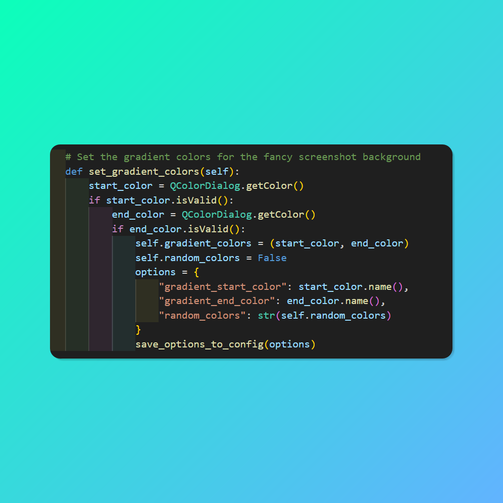

# Fancy Screenshot Creator

Fancy Screenshot Creator is a Python application that allows you to take screenshots with customizable gradient backgrounds and drop shadows. It provides a draggable icon that stays on top of your desktop, allowing you to quickly take a screenshot and preview it with a fancy background.



## Features

- Customizable gradient backgrounds
- Drop shadows around the screenshot
- Random color mode for gradient backgrounds
- Draggable icon for easy access
- Preview window with fade-out animation
- Save screenshots as PNG files

## Requirements

- Python 3.x
- PyQt5

## Installation

1. Clone this repository or download the source code.
2. Install PyQt5 using pip:

   ```
   pip install PyQt5
   ```

3. Run the `main.py` file:

   ```
   python main.py
   ```

## Usage

1. Launch the application by running `main.py`.
2. Drag the icon to your desired location on the desktop.
3. Right-click the icon to access the context menu.
4. Select "Take Screenshot" to start selecting the area for the screenshot.
5. Adjust the gradient colors or enable random colors in the "Options" menu.
6. View the preview of the fancy screenshot and click on it to open the image in the default image viewer.

## License

This project is licensed under the MIT License.